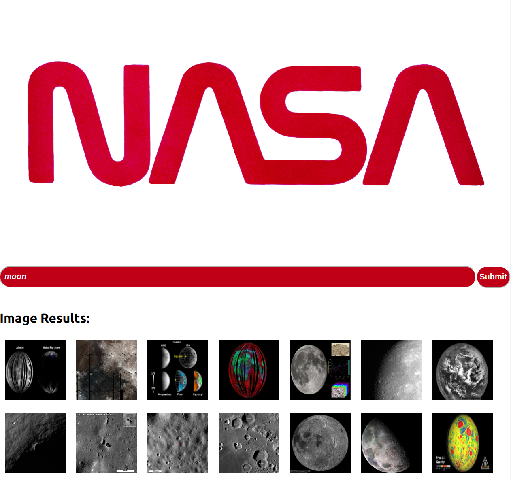
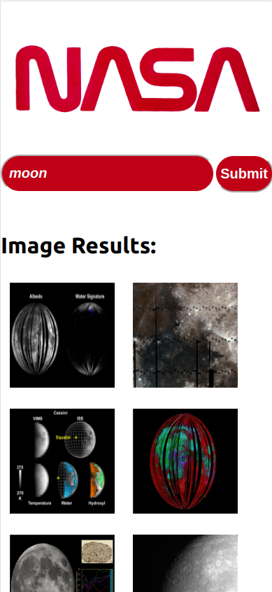
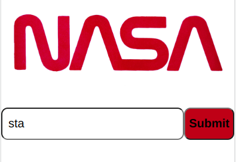
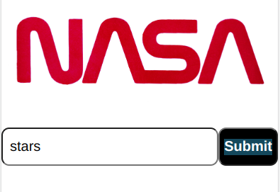
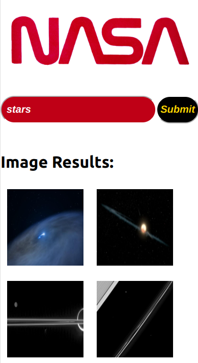

# React Tech Test
A NASA search engine which will search the database for records matching your entry.

Just enter the information you are looking for into the search bar and hit "Submit" a list of images matching your description will appear.

On Desktop Site:

 

On Mobile Site:
  

----------------
 ### Installation Instructions
1. Run `git clone https://github.com/SuzBarnes/react-tech-test.git` into the console.
2. `cd` into the new directory
3. Run `npm install`
----------------
### Useful Commands:
|How to...| Command  | Further Details|
|---------|----------|----------------|
|Start the app|`npm start`|it will load on localhost:3000|
|Test| `npm test`| the tests will take place and any errors will be displayed in your console|
|Format| `npx prettier --write .`| Prettier is the ESLint tool used to help with formatting of the App
----------------
### How to use:
1. Use the search bar to enter the image you would like to look for: 

2. Click the "Search" button

3. A table of images fitting the description will be visible.

----------------
### Technologies
- Created by bootstrapping the Create React App (https://github.com/facebook/create-react-app).
- Uses JavaScript, JSX, CSS.
- Packages used Axios, PropTypes.
- Testing utilities used Jest, React Testing Library
----------------
### Further time
If I had further time I would have loved to:
- open the image file larger when clicked,
- adjusted the CSS to make the App  more interactive,
- added an improved error messages when a search returned no results
- written further tests,

Created by Suzannah  Barnes 2022